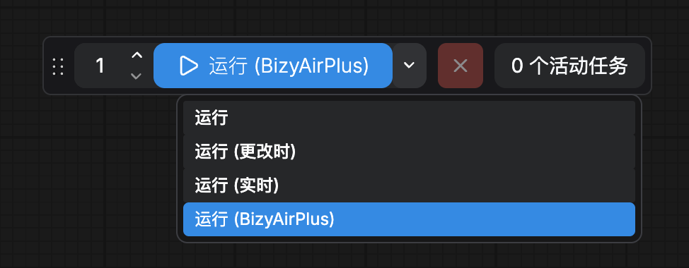
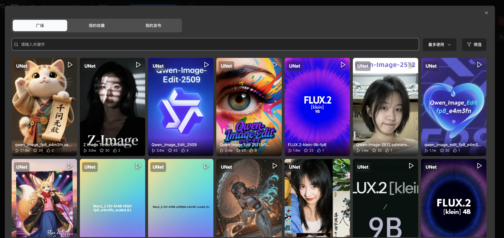

# BizyAirPlus

ComfyUI 插件，无缝实现本地工作流工作流云端执行。

## 功能特性

### 一键切换云端模式

在 ComfyUI 运行下拉菜单选择 **「运行（BizyAirPlus）」** 模式后，执行的工作流自动在云端运行，保持本地 UI 操作体验。


### 丰富的云端执行模型选择

可以在原来本地工作流的模型加载节点通过点击widget在社区中选择要执行的模型：

- 支持 LoRA、Checkpoint、Controlnet、VAE 等模型类型筛选
- 支持 Flux.2、Qwen-Image、Z-Image 等基础模型筛选
- 支持关键词搜索
- 我的模型 / 社区模型 / 官方模型



### 任务管理

支持实时进度查看、任务中断和取消。

## 安装

1. 克隆该仓库到本地Comfyui的custom_node目录下

```bash
git clone https://github.com/siliconflow/BizyAirPlus.git
```

```bash
cd BizyAirPlus
pip install -r requirements.txt
```

安装后重启 ComfyUI，插件自动加载。

## 配置

### 设置 API Key

插件需要 BizyAir API Key 才能使用：
请先前往bizyair.cn注册账户获取apikey

## 使用

1. 启动 ComfyUI
2. 在运行按钮下来菜单中选择 **运行（BizyAirPlus）**
3. 如未配置 API Key，按提示输入
4. 构建工作流后点击 **执行**
5. 工作流自动在云端运行，进度实时回传
6. 执行完成后结果自动返回本地

## 常见问题

**Q: 提示 API Key 未设置？**
A: 请在 BizyAirPlus 模式界面输入你的 API Key，或设置环境变量 `BIZYAIR_API_KEY`。

**Q: 云端执行失败？**
A: 检查 API Key 是否有效，网络连接是否正常，或查看 ComfyUI 控制台错误日志。

**Q: 如何切换回本地执行？**
A: 关闭 BizyAirPlus 模式即可恢复本地执行。
