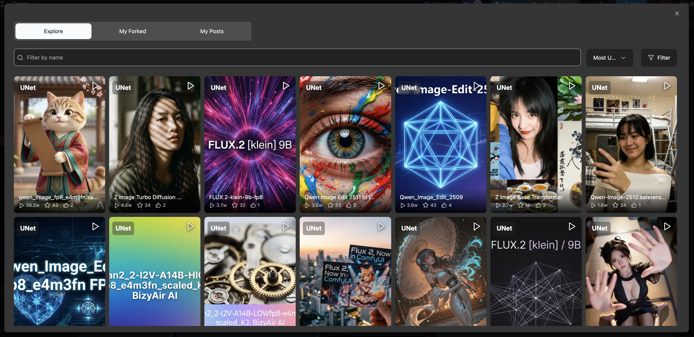

#  BizyAirPlus

**English** | [简体中文](README.zh-CN.md)

BizyAirPlus brings BizyAir cloud execution to ComfyUI while preserving the familiar local workflow editing experience. Build and edit workflows locally, submit them to BizyAir for execution, and receive progress updates and results directly in ComfyUI.

## Features

- Switch between cloud and local execution from a dedicated **BizyAirPlus ON/OFF** button in the ComfyUI action bar.
- Select cloud models directly from supported model widgets, including LoRA, Checkpoint, ControlNet, and VAE models.
- Filter models by type, base model, and keyword, and browse community or personal models.
- Use promoted model widgets, nested subgraphs, and multiple instances of the same subgraph.
- Use model selection with both LiteGraph nodes and Vue Nodes (Node 2.0).
- View live progress, previews, and results, with support for interrupting or cancelling a cloud task.
- Automatically upload workflow inputs and return generated outputs to the local ComfyUI session.
- Follow the language selected in ComfyUI.




## Installation

Clone this repository into the ComfyUI `custom_nodes` directory, then install its dependencies with the same Python environment used to run ComfyUI:

```bash
cd /path/to/ComfyUI/custom_nodes
git clone https://github.com/siliconflow/BizyAirPlus.git
cd BizyAirPlus
python -m pip install -r requirements.txt
```

Restart ComfyUI after installation.

On startup, BizyAirPlus ensures that its required packages are installed and checks PyPI for a newer `bizyair-cloudberry` release.

- Set `BIZYAIRPLUS_SKIP_UPDATE=1` to skip the latest-version check.
- Set `BIZYAIRPLUS_CHECK_ONLY=1` to report an available update without installing that update.

Required dependency versions may still be installed even when either option is enabled.

## Getting Started

1. Start ComfyUI and find the **BizyAirPlus** button in the action bar.
2. Click the button to turn BizyAirPlus **ON**.
3. If this is your first time using BizyAir, visit [bizyair.ai](https://bizyair.ai), create an account, and obtain an API Key. Enter the key when prompted.
4. Click a supported model widget and choose a model from the BizyAir model selector.
5. Queue the workflow as usual.
6. Follow its progress in ComfyUI and retrieve the result when execution finishes.

Turn the BizyAirPlus button **OFF** whenever you want to return to local execution.

Example workflows are available in [`example_workflows/`](example_workflows/).

## Configuration

### API Key

First-time users should visit [bizyair.ai](https://bizyair.ai), create an account, and obtain an API Key. The easiest way to configure the key is to turn BizyAirPlus on and use the prompt that appears. You can also set it from:

```text
Settings > BizyAirPlus > API Key
```

The saved key is stored at:

```text
~/.BizyAirPlus/apikey.ini
```

Alternatively, set the `BIZYAIR_API_KEY` environment variable. An environment variable takes precedence over the saved key.

Linux and macOS:

```bash
export BIZYAIR_API_KEY=sk-xxxxxx
```

Windows PowerShell:

```powershell
$env:BIZYAIR_API_KEY="sk-xxxxxx"
```

### Language

Change the interface language from:

```text
Settings > Comfy > Locale
```

BizyAirPlus settings are translated into English, Simplified Chinese, and Traditional Chinese. Runtime controls, prompts, and the model selector currently use English or Simplified Chinese.

## Troubleshooting

### The BizyAirPlus button is missing

Make sure the dependencies were installed with the Python environment used by ComfyUI, then restart ComfyUI. You can check the installed runtime package with:

```bash
python -m pip show bizyair-cloudberry
```

### BizyAirPlus reports that the API Key is missing

Enter the key through the BizyAirPlus prompt or `Settings > BizyAirPlus > API Key`, or set `BIZYAIR_API_KEY` before starting ComfyUI.

### Cloud execution fails

Check that the API Key is valid and the network is available. The ComfyUI console usually contains the detailed error.

### How do I switch back to local execution?

Click the BizyAirPlus action-bar button so that it displays **OFF**.

## Support

Report problems or request features through [GitHub Issues](https://github.com/siliconflow/BizyAirPlus/issues).
